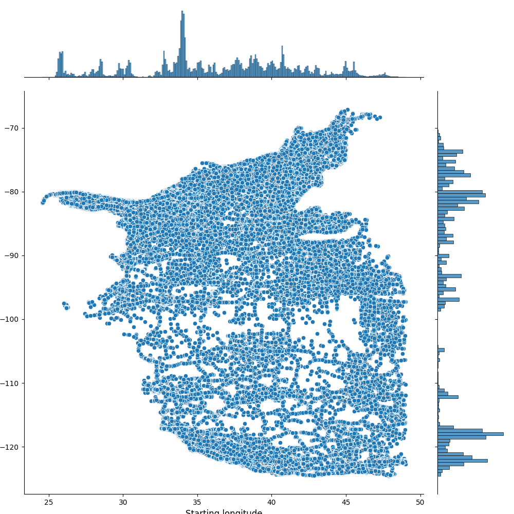
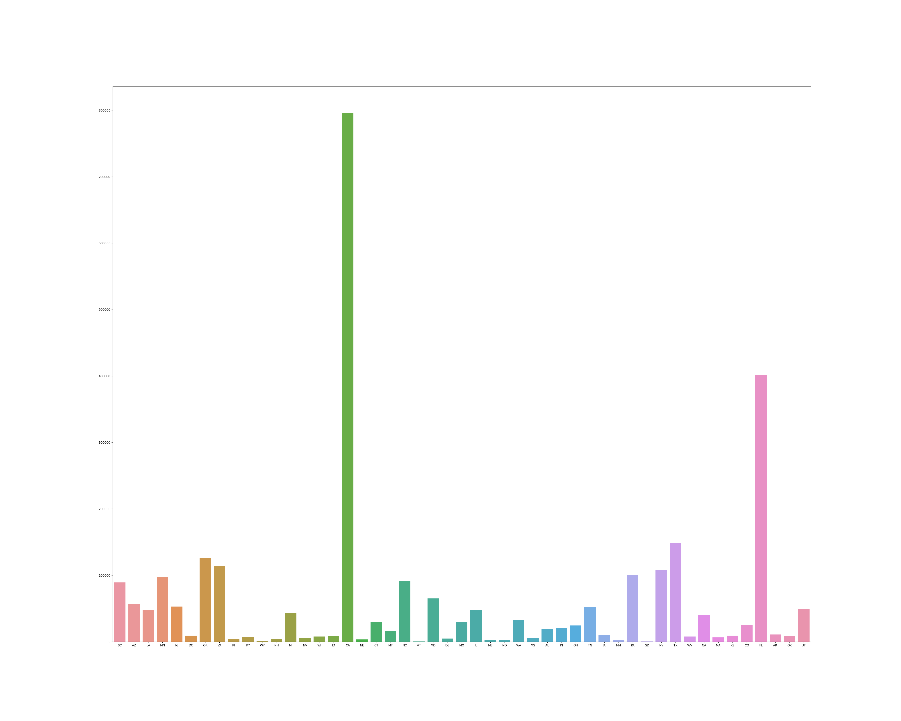
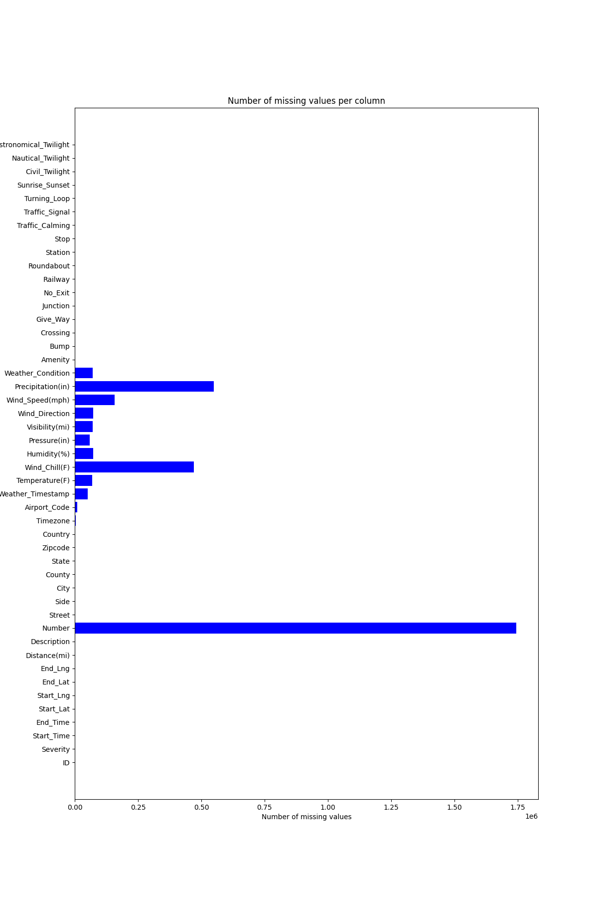

Pyspark Traffic Detection

First install the dataset from [kaggle](https://www.kaggle.com/datasets/sobhanmoosavi/us-accidents?resource=download). Put the dataset in the main repository and call `python main.py`. Generates figures to the output folder for analysis. The dataset is approximately 1 GB.

Spark MLlib is necessary in order to run the linear regression model. Currently on RMSE, MAE, R2 (Pearson's) are the only metrics computed on the model.

By default, PySpark is run in Standalone mode for prototyping, but can be deployed to a Google Cloud Storage Bucket.

Jointplot of latitude and longitude of accidents from 2019-2021.

Histogram of accident distribution per state.

Missing values in the dataset by column.

Installation:

1. `conda create -n "pyspark" python=3.10`
2. `conda install pip`
3. `pip install -r requirements.txt`

Usage:

1. `python main.py --help` in order to view all possible output plots.
2. `python main.py --train` trains the linear regression model. By default, regularization is turned on and the dataset is trained with a subset of the features from the original dataset specified by the VectorAssembler object. Train-test split can be specified as well.
